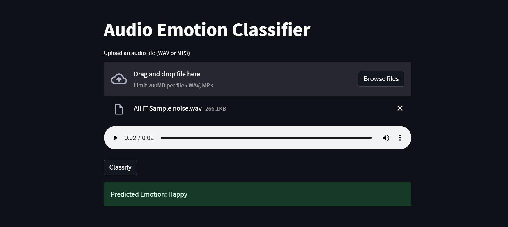

# **Audio Emotion Classifier**

This project is an audio emotion classifier designed to identify emotions in audio recordings using advanced machine learning techniques. The classifier is built using data from the SAVEE, RAVDES, and TESS datasets.
Deployed Link : https://audio-emotion-classifier-32c4bmywbanprhojtghzze.streamlit.app/

## Overview
The goal of this project is to accurately detect emotions from audio signals. The model uses Mel Frequency Cepstral Coefficients (MFCCs) for feature extraction, which effectively captures the essential characteristics of audio signals. The classifier is based on an LSTM neural network, which is well-suited for sequential data.

## Features
- **Datasets:** SAVEE, RAVDES, and TESS.
- **Feature Extraction:** Mel Frequency Cepstral Coefficients (MFCCs).
- **Model:** LSTM-based neural network.
- **Deployment:** Streamlit for the web interface and Docker for containerization.

## Data Preprocessing
- **Loading and Resampling:** Audio signals are loaded and resampled to 16000 Hz.
- **Segmentation:** Audio signals are cropped to specific time frames.
- **Noise Addition:** Noise is added to enhance model robustness.
- **Feature Extraction:** MFCC features are extracted from the audio signals.
- **Sequence Padding:** Features are padded to a maximum sequence length of 100.

## Model Architecture
The model is built using TensorFlow and consists of:

- Two LSTM layers for sequential data processing.
- A dense layer with ReLU activation.
- A dropout layer for regularization.
- An output layer with softmax activation for emotion classification.

## Training and Evaluation
- **Training:** The model is trained with a learning rate of 0.001 over 20 epochs.
- **Validation:** A portion of the training data is used for validation to tune hyperparameters.
- **Testing:** The model's performance is evaluated on a separate test set.

## Deployment
The application is deployed using Streamlit, providing an interactive web interface for real-time emotion classification. Docker containers are used to ensure consistent and reproducible deployment across different environments.

## How to run 
- Make sure all the required libraries are installed including docker desktop.
- Clone the repository
- Turn on docker engine
- Run the following commands to build and run the docker container 
    - docker build -t deepfake-audio-detection .
    - docker images
    - cd ..
    - docker run -p 8501:8501 deepfake-audio-detection
- The streamlit app will run at the given address. http://localhost:8501

## Demo Image

## Demo Video
https://github.com/Vishu-Aasliya/Audio-Emotion-Classifier/assets/97456648/7acc2164-6876-4ea7-8820-90250791a1ca

## Conclusion
This audio emotion classifier demonstrates the integration of signal processing, deep learning, and deployment technologies to create a robust system for real-time emotion recognition from audio signals.

## Contributors
- Vishu Aasliya
- Shreyansh Agarwal
- Manan Hingorani

